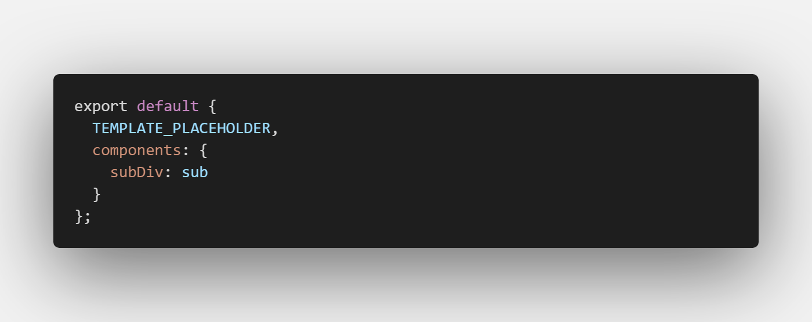

# vue-admin

- [github 国内访问速度慢](https://shonesinglone.github.io/var-admin/)
- [gitee 免费版不能自动部署](https://shonesinglone.gitee.io/var-admin/)
- [coding 能自动部署，但是访问地址是随机码 jz0a27.coding-pages.com](https://jz0a27.coding-pages.com/public/login.html)

基于SystemJS，使用VueJS编写基座的微前端Demo。

- 以微件为单位构建应用；
- 无须webpack打包；
- 在线babel转译ES7（async/await）；
- 支持.vue单文件；
- 支持less在线编译；
- 支持IE11；
- 使用Koa2+webpack实现基座HRM开发。

## 参考

- [Server-sent_events](https://developer.mozilla.org/en-US/docs/Web/API/Server-sent_events#Tools)
- [eventsource](https://github.com/EventSource/eventsource)
- [TypeScript-Node-Starter](https://github.com/microsoft/TypeScript-Node-Starter)
- [stylus-lang 因 node而生](http://stylus-lang.com/)
- [实施微前端的六种方式](https://segmentfault.com/a/1190000015566927)
- [一个电商的微前端落地实现](https://www.jianshu.com/p/81272689a134)
- [网易严选企业级微前端解决方案与落地实践](https://mp.weixin.qq.com/s/x2N-Y5xZV-XbrqxDT_wLKA)
- [原子设计理论](https://www.uisdc.com/atomic-design-theory)
- [Atomic Design原子设计理念](http://www.woshipm.com/pd/728887.html)
- [设计系统](https://zhuanlan.zhihu.com/p/33345487)
- [HTTP 响应代码](https://developer.mozilla.org/zh-CN/docs/Web/HTTP/Status)
- [webpack plugins](https://www.webpackjs.com/plugins/)
- [eslint](https://eslint.vuejs.org/user-guide/#installation)
- [怎么使用 Service Worker](https://lavas.baidu.com/pwa/offline-and-cache-loading/service-worker/how-to-use-service-worker)
- [Git-工具-子模块](https://git-scm.com/book/zh/v2/Git-%E5%B7%A5%E5%85%B7-%E5%AD%90%E6%A8%A1%E5%9D%97)

## 说明

- （一个组件就是一个应用？）

## package

``` bash
npm i -g webpack webpack-cli
npm i extract-text-webpack-plugin@next
npm i -S vue-highlightjs monaco-editor
yarn add -D webpack webpack-cli
yarn add -D stylus stylus-loader confman vue-loader vue-template-compiler stylus stylus-loader postcss-loader postcss-flexbugs-fixes

```


~~node-sass sass-loader~~安装失败神烦

## 生成vue组件的vs code插件

[generatevuecomponent](https://marketplace.visualstudio.com/items?itemName=ShoneSingLone.generatevuecomponent)

## Utils

- [ ] loadJS的处理流程
- [ ] resolvePath 的处理流程
  - 约定以static开头
- [ ] lazyLoadComponent 的处理流程
  - [Blob](https://developer.mozilla.org/en-US/docs/Web/API/Blob)fetch =》 blob =》 text =》 replace
  - [w3c-Blob](https://w3c.github.io/FileAPI/#constructorBlob)

md5

## 约定

在相同的目录下
resolvePath以static为前缀

### page 业务页面

### test 测试、展示页面

## 文档

;
VueLoader 方便替换字符串，妥协的写法。

- 修改了加载过程，主要是Vue单文件的字符串拼接。
  - public\static\lib\systemjs\system.src.js
  - public\static\lib\systemjs\extras\transform.js

~~- [idb-keyval](https://github.com/jakearchibald/idb-keyval/blob/master/README.md)~~在IE上报错，兼容性不好
- [localForage](https://github.com/localForage/localForage)

hash 升级

---
<!-- 不明白 -->
req.end is not function
node_modules\webpack-hot-middleware\middleware.js

```js
req.on('close', function () {
  console.error("close")
  if (!res.finished) res.end && res.end();
  delete clients[id];
});
```

## axios 拦截封装

- 403 权限
  - 跳转 退出逻辑（清除敏感信息）
- 超时

EventBus 全局通信：messageBox not

## 缓存

如果有耕细粒度的缓存，可以配置映射表，为每一个需要缓存的文件单独设置版本号

fetch是否有兼容性问题？=>XMLHttpRequest

除了main.js
静态资源缓存=》手动维护？！(毕竟)

缓存分级别
  A:大，最不容易变，如babeltransformjs antdesign element-ui=》单独处理 独立版本号
  B:大小一般 容易变，业务代码 如Login.vue =》一起处理 统一本版本号

1. 对比版本 STATIC_RES_VERSION
    1. 不同就清空加入版本信息
    1. id get
        1. 有直接输出
        1. 没有
        1. fetch
        1. set

## 通知处理

### messageBox

ant

```js
                EventBus.emit("notification_error", {
                    message: "Unauthorized",
                    description: "权限认证失败"
                });

```
