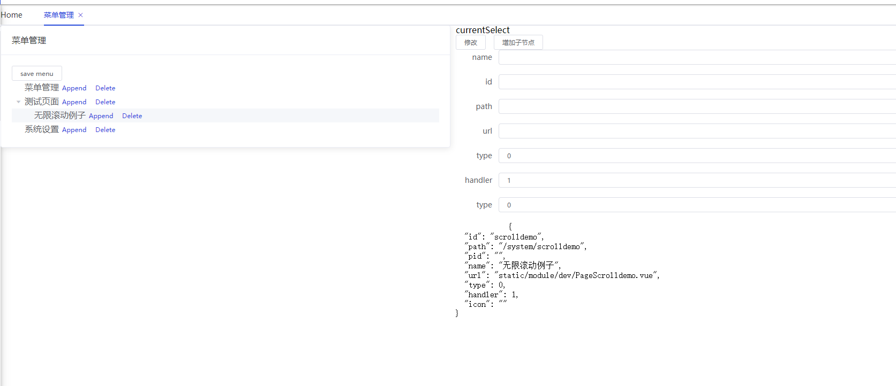

# VAR-ADMIN

Vue\Angular\React

- [readme](https://shonesinglone.github.io/var-admin)
  - [github](https://shonesinglone.github.io/var-admin/public/login.html)
  - [gitee 免费版不能自动部署](https://shonesinglone.gitee.io/var-admin/login.html)
  - [coding 能自动部署，但是访问地址是随机码 jz0a27.coding-pages.com](https://jz0a27.coding-pages.com/public/login.html)

基于SystemJS，使用VueJS编写基座的微前端Demo。
如果是内部使用的中后台系统，第一次加载资源的时间漫长是可以忍受的，而且内部网络速度按常理是比较快的。
如果确实有需要，也是可以优化（按照优化手段，是可以渐进增强的，毕竟说到底还是三驾马车在跑）。

- 以微件为单位构建应用；
- 无须webpack打包；
- 开发时可以单独用相关脚手架工具，热替换这类的丝滑开发体验一样不少。
- 在线babel转译ES7（async/await）；
- 支持.vue单文件；
- 支持less在线编译；
- 支持IE11；
- 使用Koa2+webpack实现基座HRM开发。

关键 > DOM.replace("#app",ApplicationInstance)=》先占位模块再替换（web开发基本操作）

你要问有什么意义，可能就只是————我喜欢:)
在线编辑，提交即部署。

## bootstrap

```js
 "scripts": {
   /* git push 之后调用,修改资源缓存版本号 */
    "changeversion": "node ./config/pre/changeversion.js",
    "git:pull": "git pull && git pull gitee master && git pull coding master",
    "git:push": "npm run changeversion && git push && git push gitee master && git push coding master",
    "lint": "eslint . --ignore-path .eslintignore",
    "lint:fix": "eslint --fix . --ignore-path .eslintignore",
    /* 基座相关，产出main.js */
    "build": "cross-env NODE_ENV=production webpack --progress --profile --config config/index.js --json > stats.json",
    /* koa HRM 可以添加api：比如本地开发可以修改菜单menu.json, /api/menu */
    "start": "node server.js",
    "start:s": "cross-env NODE_ENV=development nodemon server.js",
    "serve": "cross-env NODE_ENV=production PORT=10080 pm2 start server.js -i 4 --name koa-webpack-example --merge-logs --log-date-format='YYYY-MM-DD HH:mm Z' && pm2 save 2> /dev/null",
    /* vue-cli 开发微件 */
    "vue:s": "vue-cli-service serve",
    "vue:b": "vue-cli-service build",
    /* vue-cli 打包libary UMD 通过懒加载JS资源 */
    "vl": "vue-cli-service build --target lib --name vlibs --dest public/static/vlibs src/index.libs.js "
  },
```

## 参考

- [Bundleless](https://mp.weixin.qq.com/s?__biz=MzIzOTU0NTQ0MA==&mid=2247497574&idx=1&sn=3c8c88f6336436c2dd311069568c4c1e&chksm=e92aca69de5d437f6ba5bd9c00da5396ba5817241c955ddd9c438bf071a252e1025010a0b89f&scene=126&sessionid=1594345206&key=842151d1d681a9dfda94e4c890c25f4b580fccf7ae6547f30920f0011b3fb1b4ae4ffcc98d8dd7a1657ce8de955b6cd78657478840ea2d0fb6e07ecf17625a9df0734c8eed0917c28f729eafbe4636aa&ascene=1&uin=NTY4MTYyOTM1&devicetype=Windows+10+x64&version=62090070&lang=zh_CN&exportkey=A5MbNrMwb%2FyoyNX5cATd0Lw%3D&pass_ticket=vh%2Fhki36G1zswa3xBB2a9B088ypu1Ch2LEvirJg1fIPBgtgDk7ceO%2BHd608c4%2BO2)
- [rollupjs](https://rollupjs.org/guide/en/#using-config-files)
- [Server-sent_events](https://developer.mozilla.org/en-US/docs/Web/API/Server-sent_events#Tools)
- [eventsource](https://github.com/EventSource/eventsource)
- [TypeScript-Node-Starter](https://github.com/microsoft/TypeScript-Node-Starter)
- [stylus-lang 因 node而生](http://stylus-lang.com/)
- [实施微前端的六种方式](https://segmentfault.com/a/1190000015566927)
- [一个电商的微前端落地实现](https://www.jianshu.com/p/81272689a134)
- [网易严选企业级微前端解决方案与落地实践](https://mp.weixin.qq.com/s/x2N-Y5xZV-XbrqxDT_wLKA)
- [原子设计理论](https://www.uisdc.com/atomic-design-theory)
- [Atomic Design原子设计理念](http://www.woshipm.com/pd/728887.html)
- [设计系统](https://zhuanlan.zhihu.com/p/33345487)
- [HTTP 响应代码](https://developer.mozilla.org/zh-CN/docs/Web/HTTP/Status)
- [webpack plugins](https://www.webpackjs.com/plugins/)
- [eslint](https://eslint.vuejs.org/user-guide/#installation)
- [怎么使用 Service Worker](https://lavas.baidu.com/pwa/offline-and-cache-loading/service-worker/how-to-use-service-worker)
- [Git-工具-子模块](https://git-scm.com/book/zh/v2/Git-%E5%B7%A5%E5%85%B7-%E5%AD%90%E6%A8%A1%E5%9D%97)
- [webpack-visualizer](http://chrisbateman.github.io/webpack-visualizer/)
- [webpack-lazy-loading](https://webpack.docschina.org/guides/lazy-loading/#%E6%A1%86%E6%9E%B6)
- [code-splitting](https://webpack.docschina.org/guides/code-splitting/#%E5%85%A5%E5%8F%A3%E8%B5%B7%E7%82%B9-entry-points-)
- [output :__webpack_public_path__](https://webpack.docschina.org/concepts/output/#%E9%AB%98%E7%BA%A7%E8%BF%9B%E9%98%B6)
- [MessageChannel](https://developer.mozilla.org/zh-CN/docs/Web/API/MessageChannel)
- [rollup plugins](https://www.codercto.com/a/40178.html)
- [rel-noopener-noreferrer](https://stackoverflow.com/questions/50709625/link-with-target-blank-and-rel-noopener-noreferrer-still-vulnerable)

## Error

- [rollup : 无法加载文件 ******rollup.ps1。](https://developer.mozilla.org/zh-CN/docs/Web/API/MessageChannel)
  - Restricted 执行策略不允许任何脚本运行。
  - AllSigned 和 RemoteSigned 执行策略可防止 Windows PowerShell 运行没有数字签名的脚本。
- [less javascriptEnable](https://juejin.im/post/5ca99f4e6fb9a05e6668ae85)

loadLess({url:"",id:"",content:""})
如果有url 加载url 添加 style块 id=`less${id}`,如果是content,直接编译content

$loadLess("static/style/less/Shell.less");

```js
set-executionpolicy remotesigned
```

- 缓存开发版本的main.js HRM导致重复刷新

## 说明

- 实际运行是public下的文件，部署所需

## package

``` bash
npm i -g webpack webpack-cli
npm i extract-text-webpack-plugin@next
npm i -S vue-highlightjs monaco-editor
yarn add -D webpack webpack-cli
yarn add -D stylus stylus-loader confman vue-loader vue-template-compiler stylus stylus-loader postcss-loader postcss-flexbugs-fixes

```


~~node-sass sass-loader~~安装失败神烦，弃之。less在线编译不香吗？gitee的webIDE，提交就是部署不香吗？要用你node-sass？？

## 生成vue组件的vs code插件

~~[generatevuecomponent](https://marketplace.visualstudio.com/items?itemName=ShoneSingLone.generatevuecomponent)~~

## （瘦）基座开发

全局变量
main whiteList version isloadMain
_main

应该更通用，`_`：

_.$全局方法
_.$$单例
_.lodash自有方法

## 路由分发

md5路径

## Utils

## 约定

- [ ] loadJS的作用是加载js使之运行
  - 从remote获取 add script
  - 或者indexedDB缓存 get and eval
  
- [ ] resolvePath 的处理流程
  - 约定以static开头
- [ ] lazyLoadComponent 的处理流程
  - [Blob](https://developer.mozilla.org/en-US/docs/Web/API/Blob)fetch =》 blob =》 text =》 replace
  - [w3c-Blob](https://w3c.github.io/FileAPI/#constructorBlob)

md5

在相同的目录下
resolvePath以static为前缀

### 通信系统

管理应用机制
通信机制 劫持 $iframe

### page 业务页面

### test 测试、展示页面

## 文档

;
VueLoader 方便替换字符串，妥协的写法。

- 修改了加载过程，主要是Vue单文件的字符串拼接。
  - public\static\lib\systemjs\system.src.js
  - public\static\lib\systemjs\extras\transform.js

~~- [idb-keyval](https://github.com/jakearchibald/idb-keyval/blob/master/README.md)~~在IE上报错，兼容性不好

hash 升级

---
<!-- 不明白 -->
req.end is not function
node_modules\webpack-hot-middleware\middleware.js

```js
req.on('close', function () {
  console.error("close")
  if (!res.finished) res.end && res.end();
  delete clients[id];
});
```

## axios 拦截封装

- 403 权限
  - 跳转 退出逻辑（清除敏感信息）
- 超时

EventBus 全局通信：messageBox not

## 缓存

- [] 懒加载CDN路径问题??

缓存逻辑

- [ ] 需要重新设计一下
- [ ] 自动生成文档可以了解一下
- [ ] 主要还是考虑版本号的问题

mini是每次访问页面都需要更新的，要求绝对没有缓存；
mini版本号没有变动，直接读取缓存
版本号有变动，除了白名单上的全部清除；
（全部清除，白名单版本号没有变动再恢复回来）

- _.$$STORE_V
  - `systemjs_version`
  - `systemjs`
  - `systemjs_translated`

如果有耕细粒度的缓存，可以配置映射表，为每一个需要缓存的文件单独设置版本号

fetch是否有兼容性问题？=>XMLHttpRequest 回退到ajax版本

除了main.js
静态资源缓存=》手动维护？！

[system.src.js](https://github.com/ShoneSingLone/var-admin/blob/master/public/static/lib/systemjs/system.src.js#L3861)

- _.$$STORE
- [localForage](https://github.com/localForage/localForage)

缓存分级别
  A:大，最不容易变，如babeltransformjs antdesign element-ui=》单独处理 独立版本号
  B:大小一般 容易变，业务代码 如Login.vue =》一起处理 统一本版本号

1. 对比版本 STATIC_RES_VERSION
    1. 不同就清空加入版本信息
    1. id get
        1. 有直接输出
        1. 没有
        1. fetch
        1. set

## 通知处理

### messageBox

ant

```js
                EventBus.emit("notification_error", {
                    message: "Unauthorized",
                    description: "权限认证失败"
                });

```

## 重定向问题

## 页面Title

```js
window.__webpack_public_path__ = parentUrl + "static/lib/bundle/";
```


## 媒体查询


##

$loadCSS($resolvePath("static/css/css.css"))

零碎不可复用的补丁式样式


## localStorage Event
登入登出通信，同一个域下的统一处理 监听EventBus localStorage通知监听


## 
 /* Vue 特有 vue-antdv*/
    _.$loadComponentByURL = url => {
        
    };

    [vue-ls](https://github.com/RobinCK/vue-ls#readme)


别名@@ 路径
```js
    var PATH_PREFIX = window.APP_CONFIGS.PATH_PREFIX;
    var regEx = new RegExp("^@@/" + PATH_PREFIX, "g");
    if (regEx.test(relUrl)) {
      return relUrl.substring(3);
    }

```

路径的处理
绝对
相对
远程
文件//存疑


Route change tab之间的跳转

SHELL 全局 root 实例

PAGE_*单例

字典懒加载模块

[var-router](./readme.router.md)

侧边栏展示信息只是用来管理

1. Shell.vue mounted
1. MainSideBar getMenu trigger "menus-loaded"
1. MainSidebarSubmenu created

      EventBus.off("menus-loaded");


[ ] zong
[ ] 首屏加载资源的进度
[ ] less 在线加载
[ ] babel jsx扩展


## 码表的缓存

[zangodb](https://github.com/erikolson186/zangodb)

window.__webpack_public_path__ = `${parentUrl}${PATH_PREFIX}/lib/bundle/`;

## 菜单编辑



## 文档

## 

接口数据提供的数据有固定的字段 比如id label children 面向接口编程，在不同的组件有具体的上下文，约定字段有利于解耦

加载，进度 


## 文档的读写

1. 开发模式下，本地服务可以读取
1. 在线模式下，可以通过Gitee或者Github开放的API读写文件，commit


currentScript 可以获取路径

```js
   currentScript: function (window) {
                    var document = window.document;
                    return document.currentScript || (function () {
                        var scripts = document.getElementsByTagName("script");
                        return scripts[scripts.length - 1];
                    })();
                }
```


less 获取less代码文本之后调用的方法在哪里？


# VarContainer 与 VarChild

VarChild必须直接被VarContainer包含